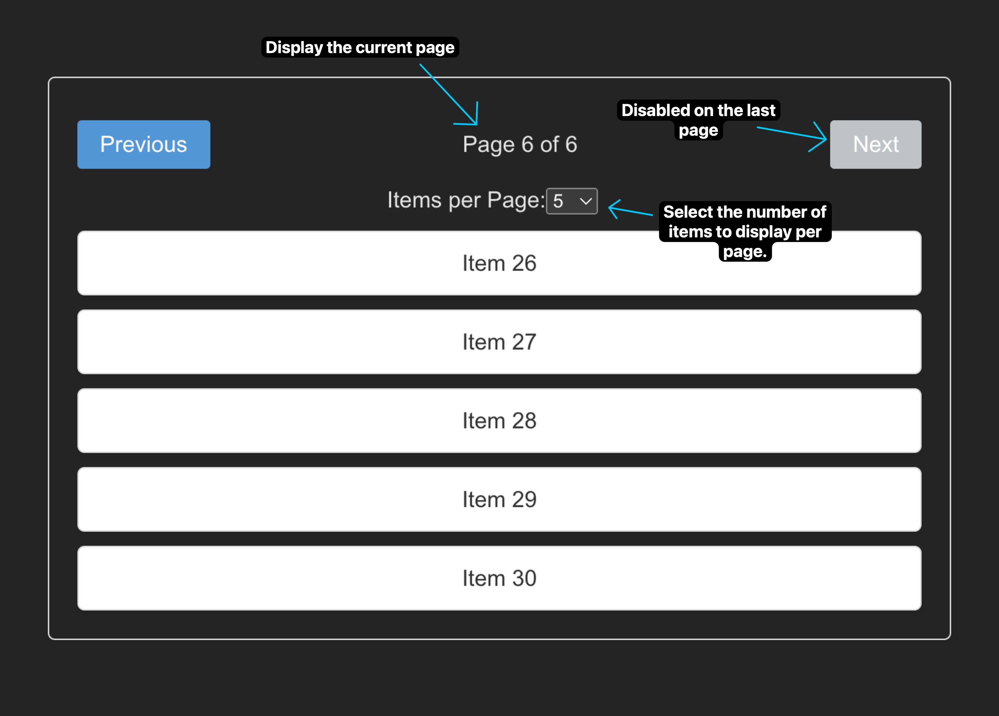
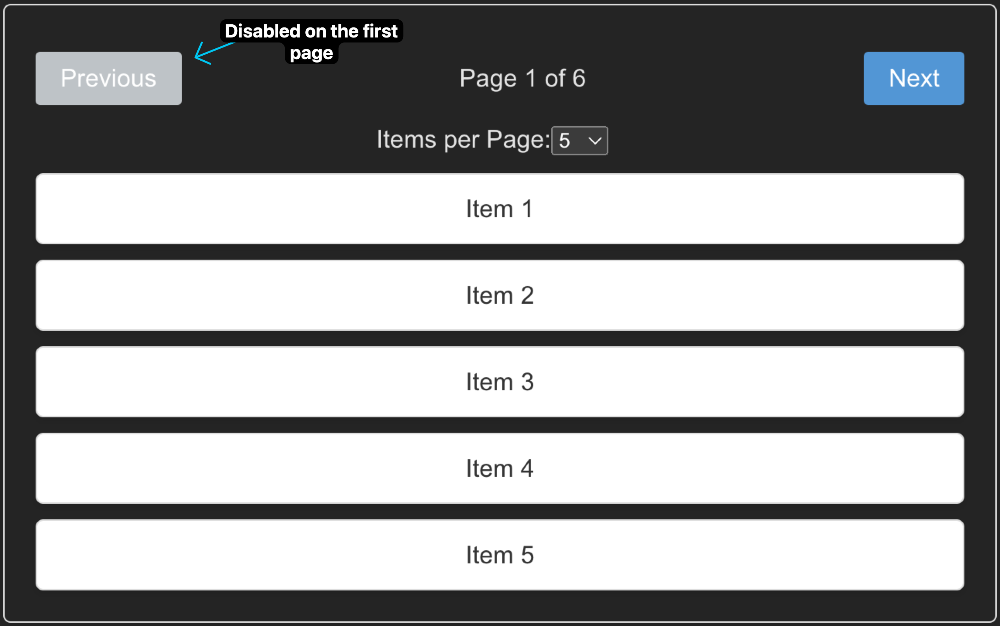

# Pagination Challenge

## Overview
This challenge is designed to test your understanding of React, specifically focusing on the usage of `useState` for state management. In this challenge, you'll be building a paginated list application where users can navigate through pages and control the number of items displayed per page.

## Features

1. **List Display:**
   - Display a list of items, each containing information such as name or description.

2. **Pagination Controls:**
   - Show pagination controls including previous and next buttons, and a current page indicator.
   - Use `useState` to manage the current page state.

3. **Page Navigation:**
   - Implement functionality to navigate to the next and previous pages.
   - Ensure not to go beyond the boundaries of the available pages.

4. **Items per Page:**
   - Allow users to choose the number of items displayed per page (e.g., 5, 10, 20).
   - Use `useState` to manage the items per page state.

## Getting Started

1. Clone this repository to your local machine and navigate to the project directory.

2. Install the required dependencies using npm.

```bash
npm install
```

3. Start the development server to view the application in your browser.

```bash
npm run dev
```

## Instructions

1. Implement the pagination controls using useState for managing the current page.
2. Enable navigation between pages and ensure that the controls are disabled when necessary.
3. Implement the option to choose the number of items displayed per page.
4. Ensure that the correct items are displayed based on the current page and items per page.
5. Customize the styling to make the application look modern and visually appealing.

## Bonus Tasks

1. **Page Number Input:**
   - Include an input field allowing users to directly input the page number they want to navigate to.
   - Use `useState` to handle the input and update the current page accordingly.

2. **Loading State:**
   - Show a loading state while fetching data from the API.
   - Use `useState` to manage a loading state.

## Screenshots

Here are some screenshots to help you understand the requirements and visualize the expected outcome.

### Default View



### Pagination Controls



## Demo Video

Here's a demo video to help you understand the functionality and visualize the expected outcome.

[Watch the Demo Video](https://youtu.be/86rOeSEZPAM)

## Feedback

If you have any questions or need clarification on any aspect of the challenge, feel free to reach out. Good luck, and happy coding!
